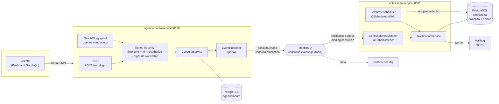
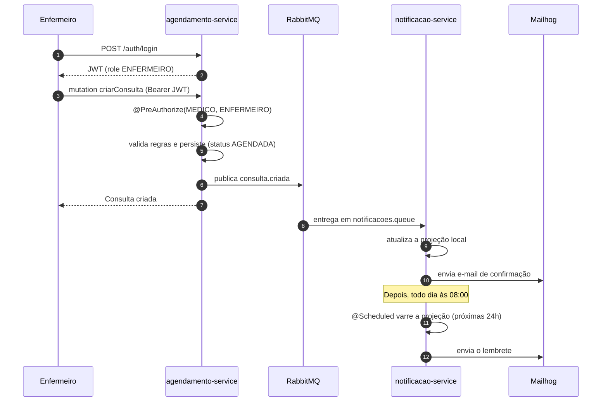

# Tech Challenge — Fase 3
### Backend hospitalar de agendamento de consultas
**FIAP — Pós-graduação em Arquitetura e Desenvolvimento Java**

Backend modular para um ambiente hospitalar: agendamento de consultas, histórico do
paciente e lembretes automáticos, com **autenticação e autorização por perfil
(Spring Security + JWT)**, **consultas flexíveis via GraphQL** e **comunicação
assíncrona entre serviços com RabbitMQ**.

---

## Sumário

- [Arquitetura](#arquitetura)
- [Como executar](#como-executar)
- [Usuários e permissões](#usuários-e-permissões)
- [API: autenticação e GraphQL](#api-autenticação-e-graphql)
- [Mensageria](#mensageria)
- [Decisões de arquitetura](#decisões-de-arquitetura-e-por-quê)
- [Testes](#testes)
- [Estrutura do repositório](#estrutura-do-repositório)

---

## Arquitetura

Dois microsserviços independentes, cada um com o **seu próprio banco** (nenhum dos dois
enxerga as tabelas do outro), conversando exclusivamente por **eventos**.



### Fluxo de um agendamento



### Serviços

| Serviço | Porta | Responsabilidade |
|---|---|---|
| **agendamento-service** | 8080 | Autenticação (JWT), criação/edição de consultas, histórico via GraphQL, publicação de eventos |
| **notificacao-service** | 8081 | Consome eventos, envia confirmações/avisos e o lembrete diário das próximas 24h |
| postgres-agendamento | 5432 | Banco do agendamento |
| postgres-notificacao | 5433 | Banco das notificações |
| rabbitmq | 5672 / 15672 | Broker + console de administração |
| mailhog | 1025 / 8025 | SMTP falso + caixa de entrada web |

**Stack:** Java 21 · Spring Boot 3.5 · Spring Security · Spring for GraphQL (schema-first) ·
Spring AMQP · Spring Data JPA · Flyway · PostgreSQL · RabbitMQ · Maven (multi-módulo) · Docker.

---

## Como executar

Pré-requisito: **Docker** e **Docker Compose**. Nada mais precisa estar instalado —
nem Java, nem Maven.

```bash
docker compose up --build
```

Isso sobe os 6 contêineres, cria os schemas via **Flyway**, insere a massa inicial e
declara a topologia do RabbitMQ. **Não há nenhum passo manual.**

| O quê | Onde |
|---|---|
| API GraphQL | http://localhost:8080/graphql |
| GraphiQL (console interativo) | http://localhost:8080/graphiql |
| Login (REST) | `POST http://localhost:8080/auth/login` |
| Caixa de entrada (Mailhog) | http://localhost:8025 |
| RabbitMQ (guest/guest) | http://localhost:15672 |

### Vendo o lembrete diário sem esperar até as 08:00

O agendador roda **todo dia às 08:00** (requisito). Para vê-lo em ação agora, suba com um
cron que dispara a cada minuto:

```bash
CRON_LEMBRETES="0 * * * * *" docker compose up --build
```

Crie uma consulta para as próximas 24 horas e observe o e-mail chegar em
http://localhost:8025 (e o log estruturado em `docker compose logs -f notificacao-service`).

### Rodando os testes

```bash
./mvnw verify
```

Os testes **não precisam de Docker**: sobem em H2 executando as mesmas migrações Flyway
de produção.

### Postman

Importe **`postman/tech-challenge-fase3.postman_collection.json`**.

Rode a pasta **`1. Autenticacao`** primeiro: os três logins gravam os tokens nas variáveis
da collection, e as demais pastas os utilizam automaticamente. A collection cobre os
logins das 3 roles, as queries e mutations com Bearer token, os casos de **acesso negado**
(role errada, ownership, sem token, token adulterado) e as validações de domínio — cada
requisição já vem com testes automáticos.

---

## Usuários e permissões

A migração `V2` cria um usuário para cada perfil. **Senha de todos: `senha123`**
(armazenada com BCrypt).

| E-mail | Perfil | Observação |
|---|---|---|
| `medico@hospital.com` | MEDICO | Dr. Carlos Andrade (paciente 1 e 2 sob seus cuidados) |
| `enfermeiro@hospital.com` | ENFERMEIRO | Ana Ribeiro |
| `paciente@hospital.com` | PACIENTE | João Souza — **paciente 1** |
| `paciente2@hospital.com` | PACIENTE | Maria Lima — **paciente 2** (existe para demonstrar o bloqueio entre pacientes) |

### Matriz de permissões

| Operação | MEDICO | ENFERMEIRO | PACIENTE |
|---|:---:|:---:|:---:|
| `POST /auth/login` | ✅ | ✅ | ✅ |
| `consultasPorPaciente` (histórico) | ✅ qualquer paciente | ✅ qualquer paciente | ⚠️ **apenas as próprias** |
| `consulta(id)` | ✅ qualquer consulta | ✅ qualquer consulta | ⚠️ **apenas as próprias** |
| `criarConsulta` (registrar) | ✅ | ✅ | ❌ FORBIDDEN |
| `atualizarConsulta` (editar histórico) | ✅ | ❌ FORBIDDEN | ❌ FORBIDDEN |

Isso reproduz exatamente o enunciado: *médicos visualizam e editam o histórico*,
*enfermeiros registram consultas e acessam o histórico*, *pacientes visualizam apenas as
suas consultas*.

O ⚠️ é a **regra de ownership**, e ela é mais forte do que um simples filtro:

- se o paciente **omite** o `pacienteId`, o filtro é forçado para o prontuário dele;
- se o paciente **informa o id de outra pessoa**, a requisição é **rejeitada** com
  `FORBIDDEN` — em vez de silenciosamente trocar o filtro, o que mascararia uma tentativa
  de acesso indevido;
- o acesso direto por id (`consulta(id: 4)`) também é verificado — não basta filtrar a
  listagem.

---

## API: autenticação e GraphQL

### 1. Login (único endpoint REST)

```bash
curl -X POST http://localhost:8080/auth/login \
  -H 'Content-Type: application/json' \
  -d '{"email":"medico@hospital.com","senha":"senha123"}'
```

```json
{
  "token": "eyJhbGciOiJIUzI1NiJ9...",
  "tipo": "Bearer",
  "expiraEmSegundos": 7200,
  "nome": "Dr. Carlos Andrade",
  "email": "medico@hospital.com",
  "role": "MEDICO"
}
```

Todas as chamadas GraphQL exigem o header `Authorization: Bearer <token>`.

### 2. Histórico de um paciente

```graphql
query {
  consultasPorPaciente(pacienteId: 1) {
    id
    dataHora
    status
    observacoes
    paciente { id nome email }
    medico { nome especialidade }
  }
}
```

### 3. Apenas as consultas futuras

O `apenasFuturas` atende diretamente ao requisito de *"listar todos os atendimentos de um
paciente ou apenas as futuras"*:

```graphql
query {
  consultasPorPaciente(pacienteId: 1, apenasFuturas: true) {
    id
    dataHora
    status
  }
}
```

Um **paciente** simplesmente omite o `pacienteId` — o serviço já sabe quem ele é:

```graphql
query {
  consultasPorPaciente(apenasFuturas: true) {
    id dataHora status medico { nome }
  }
}
```

### 4. Registrar uma consulta (MEDICO ou ENFERMEIRO)

```graphql
mutation {
  criarConsulta(input: {
    pacienteId: 1
    medicoId: 1
    dataHora: "2027-03-15T14:30:00"
    observacoes: "Consulta de rotina."
  }) {
    id
    status
    dataHora
  }
}
```

Publica `consulta.criada` → o paciente recebe a confirmação por e-mail.

### 5. Editar / cancelar uma consulta (apenas MEDICO)

Atualização **parcial**: campos omitidos são preservados.

```graphql
mutation {
  atualizarConsulta(id: 2, input: { status: CANCELADA, observacoes: "Paciente desmarcou." }) {
    id
    status
    observacoes
  }
}
```

Publica `consulta.atualizada` → o paciente é avisado e a consulta **para de receber
lembretes**.

### Como os erros aparecem

O GraphQL responde **HTTP 200 mesmo em falha**, sinalizando o problema no array `errors`.
O equivalente ao "403" é a `classification`:

```json
{
  "errors": [{
    "message": "Um paciente so pode consultar o proprio historico de consultas",
    "extensions": { "classification": "FORBIDDEN" }
  }],
  "data": { "consultasPorPaciente": null }
}
```

| Situação | Resposta |
|---|---|
| Sem token / token inválido | **HTTP 401** (barrado pelo filtro, antes do GraphQL) |
| Role errada, ou ownership violado | HTTP 200 + `classification: FORBIDDEN` |
| Regra de negócio violada | HTTP 200 + `classification: BAD_REQUEST` |
| Registro inexistente | HTTP 200 + `classification: NOT_FOUND` |

---

## Mensageria

```
                      consultas.exchange  (topic)
                                │
                                │  binding: consulta.*
                                ▼
                       notificacoes.queue
                                │
                                │  falha / payload inválido
                                ▼
              notificacoes.dlx ──▶ notificacoes.dlq
```

- **Exchange:** `consultas.exchange` (topic, durável)
- **Routing keys:** `consulta.criada`, `consulta.atualizada`
- **Fila:** `notificacoes.queue`, com binding `consulta.*`
- **DLQ:** `notificacoes.dlq` (via `notificacoes.dlx`)
- **Payload:** JSON, serializado com `Jackson2JsonMessageConverter`

```json
{
  "consultaId": 5,
  "pacienteNome": "Joao Souza",
  "pacienteEmail": "paciente@hospital.com",
  "dataHora": "2027-03-15T14:30:00",
  "medicoNome": "Dr. Carlos Andrade",
  "status": "AGENDADA",
  "tipoEvento": "CONSULTA_CRIADA"
}
```

Mensagens que o consumidor **nunca** conseguirá processar (payload malformado, sem status,
data inválida) são rejeitadas sem reenfileiramento e vão para a **DLQ** — um único evento
corrompido não pode travar a fila em retentativas infinitas.

---

## Decisões de arquitetura (e por quê)

### RabbitMQ em vez de Kafka

O enunciado permite qualquer um dos dois. O caso de uso aqui é **notificação: mensagens
discretas, com um consumidor lógico, que precisam ser entregues e confirmadas** — não um
fluxo de alto volume que múltiplos consumidores queiram reprocessar do começo.

- O **RabbitMQ** é um *message broker*: entrega, faz *ack*, redistribui e — crucialmente
  para este domínio — oferece **DLQ nativa** com uma linha de configuração. O
  roteamento por *topic* (`consulta.*`) já resolve a distribuição.
- O **Kafka** é um *log distribuído* particionado, e brilha quando se precisa de altíssima
  vazão, retenção e *replay* do histórico por consumidores independentes. Nada disso é
  requisito aqui, e ele traria um custo operacional (partições, offsets, consumer groups,
  ZooKeeper/KRaft) sem contrapartida.

Escolher Kafka aqui seria pagar a complexidade de uma plataforma de streaming para
entregar um e-mail de lembrete. **Se** o hospital passasse a exigir *event sourcing* ou
vários times consumindo o mesmo fluxo com *replay*, a troca ficaria restrita a uma classe
(veja a seguir).

### GraphQL no próprio agendamento, e não em um serviço de histórico separado

O enunciado deixa o *serviço de histórico* como **opcional**. Optamos por expor o GraphQL
no agendamento-service porque, hoje, **o histórico é exatamente a mesma tabela `consulta`
que o agendamento escreve** — separá-lo criaria um serviço que compartilharia o banco do
agendamento (acoplamento pior do que o problema que resolve) ou que precisaria de uma
sincronização cuja complexidade não se paga.

**Em produção, com escala de leitura**, a evolução natural é **CQRS**: um *read-service*
dedicado ao histórico, alimentado pelos mesmos eventos `consulta.*` que já publicamos,
mantendo uma projeção otimizada para leitura e escalando independentemente do serviço de
escrita. A arquitetura atual já está preparada para isso — os eventos existem, e o
`notificacao-service` **já é** uma prova de conceito desse padrão (veja abaixo).

### O notificacao-service mantém uma projeção local (e não consulta o banco do agendamento)

Este foi o ponto de design mais relevante do serviço de notificações. O `@Scheduled`
precisa saber *"quais consultas ocorrem nas próximas 24h"* — mas as consultas vivem no
banco **do outro serviço**.

- Abrir uma conexão JDBC no banco do agendamento seria o anti-padrão do *shared database*:
  os dois serviços passariam a compartilhar um schema, e qualquer migração no agendamento
  poderia quebrar as notificações.
- Chamar a API do agendamento a cada ciclo criaria um acoplamento **temporal**: se o
  agendamento estiver fora do ar, nenhum lembrete sai.

Em vez disso, o consumidor mantém uma **projeção local** (`consulta_agendada`), alimentada
exclusivamente pelos eventos. O agendador lê a **própria** base. É o padrão de *read model*
do CQRS, e torna o serviço **autônomo**: ele continua lembrando pacientes mesmo com o
agendamento-service indisponível.

A projeção usa **o id da consulta na origem como chave primária**, o que torna o consumo
**idempotente**: reprocessar um evento (uma redelivery do broker, por exemplo) apenas
sobrescreve a linha, sem duplicar nada.

### `status` no payload do evento

O rascunho original do payload não previa o `status`. Ele foi **acrescentado** por uma
razão funcional concreta: sem ele, o `notificacao-service` **não teria como saber que uma
consulta foi cancelada** e continuaria enviando lembretes de uma consulta que não vai
acontecer. Todos os campos originalmente especificados foram mantidos.

### A publicação fica atrás de uma porta (`EventPublisher`)

`ConsultaService` depende da interface `EventPublisher`, não de AMQP. O `RabbitEventPublisher`
é a **única** classe do serviço que conhece RabbitMQ. Duas consequências práticas: trocar o
broker (por Kafka, inclusive) significa escrever outra implementação sem tocar no domínio; e
os testes unitários do service rodam com um mock, sem broker nenhum.

### O contrato do evento é duplicado nos dois serviços

`ConsultaEvento` existe nos dois módulos, de propósito — não há um módulo `common`
compartilhado. Microsserviços que compartilham uma classe de contrato passam a compartilhar
um **ciclo de deploy**: mudar o record obriga a religar os dois. Aqui, cada lado evolui o
seu próprio schema e o acoplamento fica apenas no **formato JSON** (o consumidor ignora
campos desconhecidos, então o produtor pode adicionar campos sem quebrar ninguém).

### Ownership no service, autorização por role no resolver

São duas perguntas diferentes:

- *"Este perfil pode executar esta operação?"* → depende só da role. Fica no resolver, com
  `@PreAuthorize`. (Precisa ser por método, e não por URL, porque **todo o GraphQL trafega
  em um único `POST /graphql`** — não há path para proteger.)
- *"Este usuário pode ver **este dado**?"* → depende do dado. Fica no `ConsultaService`.

Manter o ownership no service garante que a regra **vale para qualquer porta de entrada** —
se amanhã surgir um endpoint REST ou gRPC, ele herda a proteção de graça.

### Datas como String ISO-8601

O schema usa o scalar `String` nativo em vez de um `DateTime` customizado, o que evitaria
trazer a dependência `graphql-java-extended-scalars` só por causa de um tipo. O formato é
ISO-8601 (`2027-03-15T14:30:00`), validado na entrada. Em um projeto de produção com muitos
tipos temporais, o scalar dedicado passaria a valer a pena.

### Os testes rodam as migrações Flyway de verdade

A DDL foi escrita em **SQL neutro** (`BIGINT GENERATED BY DEFAULT AS IDENTITY`), o que
permite que **as mesmas migrações** rodem em PostgreSQL (produção) e em H2 (testes). Com
`ddl-auto: validate`, se uma entidade JPA divergir da DDL, **o build quebra** — em vez de
o erro só aparecer no primeiro deploy. E, na prática, o `./mvnw verify` não exige Docker.

### Limitação conhecida: publicação dentro da transação

O evento é publicado dentro da transação que salva a consulta. Se o commit falhar *depois*
da publicação, o notificacao-service receberia um evento de uma consulta que não existe.
Para este escopo o risco é aceitável (a janela é mínima e a projeção é idempotente); a
solução canônica em produção é o padrão **transactional outbox** — gravar o evento em uma
tabela na mesma transação e publicá-lo depois do commit, com um relay.

---

## Testes

```bash
./mvnw verify
```

**45 testes**, sem necessidade de Docker:

| Suíte | O que cobre |
|---|---|
| `ConsultaServiceTest` (16) | Regras de agendamento e, sobretudo, a **regra de ownership**: paciente sem id recebe o próprio histórico; paciente pedindo o id de terceiro é bloqueado (e o id **nunca chega ao banco**); médico consulta qualquer um; publicação dos eventos; recusa de data no passado |
| `SegurancaFluxoIntegrationTest` (12) | **Fluxo de segurança ponta a ponta**: login real (BCrypt do seed) → chamada autorizada → **acesso negado por role** → ownership → 401 sem token → 401 com token adulterado |
| `ServidorHttpRealIntegrationTest` (2) | Sobe o Tomcat de verdade e fala HTTP: login → `Bearer` → GraphQL, e 401 sem token |
| `MigracoesFlywayTest` (3) | As migrações rodam e o mapeamento JPA valida contra o schema real |
| `NotificacaoServiceTest` (8) | Projeção idempotente, confirmação/cancelamento, falha de SMTP registrada sem derrubar o processamento, payload inválido → DLQ, lembrete não reenviado |
| `LembreteSchedulerTest` (3) | Janela de 24h, um lembrete por consulta, e a falha em um paciente **não interrompe** o lote |
| `ContextoAplicacaoTest` (1) | Contexto do notificacao-service sobe com o schema válido |

---

## Estrutura do repositório

```
tech-challenge-fase3/
├── pom.xml                      # POM pai (multi-módulo)
├── docker-compose.yml           # sobe tudo com um comando
├── postman/                     # collection com os casos de teste
│
├── agendamento-service/         # :8080
│   ├── Dockerfile               # multi-stage (build Maven → JRE enxuto, non-root)
│   └── src/main/
│       ├── java/br/com/fiap/agendamento/
│       │   ├── config/          # SecurityConfig, filtro JWT, RabbitConfig
│       │   ├── controller/      # AuthController (REST)
│       │   ├── graphql/         # resolvers (@PreAuthorize)
│       │   ├── service/         # ConsultaService (ownership), TokenService, porta EventPublisher
│       │   ├── messaging/       # RabbitEventPublisher (adapter AMQP)
│       │   ├── domain/          # Usuario, Paciente, Medico, Consulta
│       │   ├── repository/
│       │   ├── dto/
│       │   └── exception/       # handlers REST e GraphQL
│       └── resources/
│           ├── graphql/schema.graphqls
│           └── db/migration/    # V1 schema, V2 seed (BCrypt)
│
└── notificacao-service/         # :8081
    ├── Dockerfile
    └── src/main/
        ├── java/br/com/fiap/notificacao/
        │   ├── config/          # RabbitConfig (fila + DLQ)
        │   ├── messaging/       # ConsultaEventListener
        │   ├── service/         # NotificacaoService, LembreteScheduler, EmailSender
        │   ├── domain/          # ConsultaAgendada (projeção), Notificacao
        │   ├── repository/
        │   ├── dto/
        │   └── exception/
        └── resources/db/migration/
```
